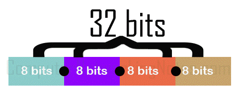
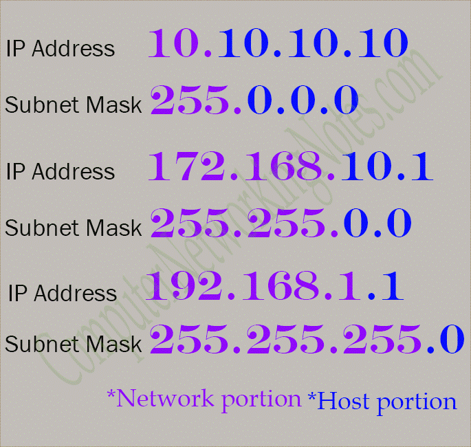
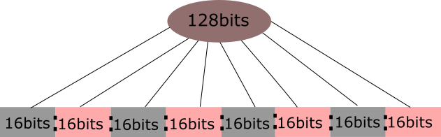
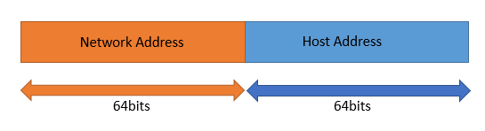
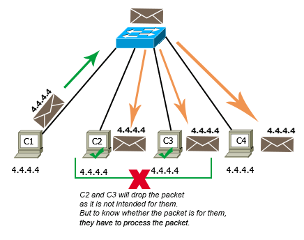
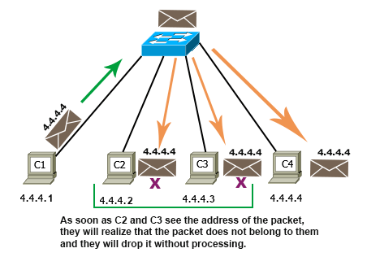
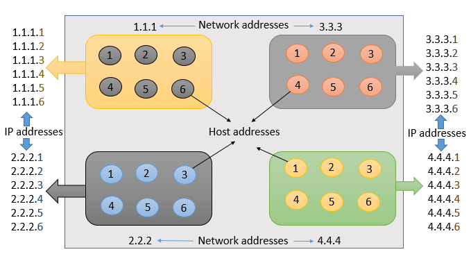
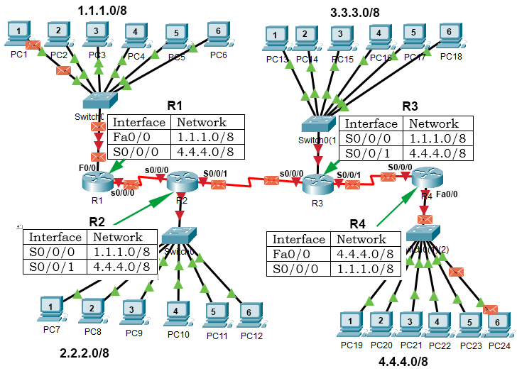

# IP address, Network address, and Host address Explained

This tutorial explains IP addresses, network addresses, host addresses, and subnet masks in detail. Learn what IP addresses are and how they work in computer networks.

If objects connected in a group want to share or exchange something, they need a specific identity to refer to each other. This unique identity is known as the address. In simple terms, addresses are a way of organizing and locating objects in a single group or multiple groups. Addresses are mainly used for two reasons: to provide a unique identity to each object in the group and to find an object in the group.

A computer network is a group of computers and various networking devices that connect to share information and resources. To uniquely identify each computer or networking device in the network, computer networks also use addresses. Addresses in computer networks are known as IP addresses. An IP address consists of two components: the network address and the host address. The network address is used to find the subnet in which the computer or the device is located and the host address is used to find the computer or the device in the subnet. If a large computer network is divided into smaller groups, each group is known as a subnet.

IP addresses can be written in three notations: binary, dotted-decimal, and hexadecimal. From these notations, computers understand only binary notation. Binary notation is complex to write and understand. To make IP addresses human friendly, IP addresses are also written in dotted-decimal and hexadecimal notations. If IP addresses are written in dotted-decimal notation or hexadecimal notation, computers automatically convert them into binary notation before processing them.

There are two versions of IP addresses: IPv4 and IPv6. The length of IP addresses is different in both versions. Both versions also use different formats to differentiate between network addresses and host addresses. Let's understand IP addresses in both versions.

### IP addresses in IPv4
IPv4 addresses are 32 bits in length. These bits are divided into four equal sections. Sections are separated by periods and written in a sequence. In measurement, 8 bits are equal to one byte or an octet. In simple words, an IP address consists of four bytes or octets separated by periods.

The following image shows how bits are arranged in IPv4 addresses.



In binary notation, all four octets are written in binary format. For example, some IP addresses in binary format are listed below.

```
00001010.00001010.00001010.00001010
10101100.10101000.00000001.00000001
11000000.10101000.00000001.00000001
```

IPv4 addresses are written and used in dotted-decimal notation. In decimal notation, all four octets are written in decimal format. A decimal equivalent value of the octet is used in each section. For example, you can write the above IP addresses in decimal notation as shown below.
```
10.10.10.10
172.168.1.1
192.168.1.1
```

### Subnet Mask

To separate network addresses from host addresses, IPv4 uses an additional component with IP addresses. This component is known as a subnet mask. In other words, in an IP address, how many bits are used in the network address and how many bits are left for the host address is determined by the subnet mask. The subnet mask is also 32 bits in length and uses the same notation that is used by the IP address.

The subnet mask assigns an individual bit for each bit of the IP address. If an IP bit belongs to the network portion, the subnet mask will turn on the assigned bit. If an IP bit belongs to the host portion, the subnet mask will turn off the assigned bit.

In binary notation, 1 (one) represents an ON bit while 0 (zero) represents an OFF bit. In dotted-decimal notation, a value range 1 to 255 represents an ON bit while a value 0 (zero) represents an OFF bit.

Following are the examples of subnet mask in binary notation: -
```
11111111.00000000.00000000.00000000
11111111.11111111.00000000.00000000
11111111.11111111.11111111.00000000
```
Following are the examples of subnet mask in decimal notation: -
```
255.0.0.0
255.255.0.0
255.255.255.0
```
An IP address is always used with the subnet mask. Without the subnet mask, an IP address is considered an ambiguous address.

Following are the examples of IP addresses with subnet mask in binary notation: -
```
00001010.00001010.00001010.00001010
11111111.00000000.00000000.00000000

10101100.10101000.00000001.00000001
11111111.11111111.00000000.00000000

11000000.10101000.00000001.00000001
11111111.11111111.11111111.00000000
```
Following are the examples of IP addresses with subnet mask in decimal notation: -
```
10.10.10.10
255.0.0.0

172.168.1.1
255.255.0.0

192.168.1.1
255.255.255.0
```
The following image shows how the subnet mask separate the network address from the host address in an IP address.



P addresses in IPv6
IPv6 addresses are 128 bits in length. These bits are divided into eight equal sections. Sections are separated by colons (:) and written in a sequence. IPv6 addresses are written in hexadecimal notation.

The following image shows how bits are arranged in IPv6 addresses.



Following are the examples of IP addresses in IPv6: -
```
2001:1238:85b3:0000:0000:a82e:aa70:7124
2001:0db8:85a3:0000:0000:8a11:0121:6213
2001:0db8:0000:85a3:8a3d:2122:0000:1542
2001:0000:0db8:85a3:0000:8a2c:3233:3312
```
Instead of using an additional component to separate network addresses and host addresses, IPv6 defines the number of bits for both types of addresses. It defines the first 64 bits as the network address and the last 64 bits as the host address.

The following image shows how IPv6 separates the network address and host address in an IP address.



### ow do host addresses work?
In computer networks, IP addresses are assigned on interfaces. An interface connects a computer or a networking device to the network. In a computer network, all interfaces must be configured with unique IP addresses. If two or more interfaces are configured with the same IP address, the network will not work.

Let's understand it through an example.

In a computer network, four computers named C1, C2, C3, and C4 are connected. All computers are configured with the same IP address. The configured IP address is 4.4.4.4/8. C1 sends a data packet to C4. Since the IP address of C4 is 4.4.4.4/8, C1 sets the destination address in the packet to 4.4.4.4/8.

The packet reaches C2, C3, and C4. They check the destination address of the packet to know whether the packet is intended for them. Since the destination address of the packet matches with the IP address configured on their interfaces, they all assume that the packet is intended for them, and they all process it.

After processing, C2 and C3 realize that the packet is not intended for them and they discard the packet. C4 accepts the packet. If C4 sends a reply packet, the reply packet will also follow the same path and will be processed by C2 and C3 unnecessarily.

The following image shows this example.



In a busy network where interfaces process millions of packets per second, an overlap of IP addresses can bring the entire network down. To avoid such a situation, computer networks use a unique IP address on each interface.

Let's take our example network again and make all IP addresses unique. To make all IP addresses unique, change their host addresses. For example, you can set the new IP addresses of C1, C2, C3, and C4 to 4.4.4.1/8, 4.4.4.2/8, 4.4.4.3/8, and 4.4.4.4/8, respectively.

After this change, when C1 sends packets to C4 and the packet reaches C2, C3, and C4, only C4 processes the packet. C2 and C3 immediately discard the packet because the destination address of the packet and the IP address of their interfaces are different.

The following image shows how a host address works in the network.



If all interfaces are configured with unique IP addresses, they can access each other easily.

### How do network addresses work?
Just as a host address provides a unique identity to the interface in a subnet, a network address provides a unique identity to the subnet in the network. A network address is the common address of all interfaces that belong to a specific subnet.

Let's take an example to understand how network addresses work.

In a network, four subnets are connected. Network addresses of these subnets are 1.1.1, 2.2.2, 3.3.3, and 4.4.4. Each subnet contains 6 PCs. Host addresses of PC1, PC2, PC3, PC4, PC5, and PC6 are .1, .2, .3, .4, .5, and .6, respectively.

In IP addresses, network addresses are always written before host addresses. If we write the network address before the host address of a PC, we will get the IP address of that PC. The following image shows this process in our example network.



Hosts or PCs of different subnets cannot communicate or exchange data directly. To connect different subnets, routers are used. Routers are networking devices that connect different subnets or networks. Routers store the network addresses of all available subnets in their routing tables.

If a computer wants to send a data packet to a computer that belongs to another subnet, it sends the data packet to the gateway router. A gateway router is the router that connects the subnet to other subnets of the network. The gateway router forwards the data packet to the router that is connected to the destination subnet or know how to reach the destination subnet. To forward data packets, routers use only network addresses.

Let's understand it through our example. Our example network is divided into four subnets. To connect these subnets, four routers: R1, R2, R3, and R4 are used. R1, R2, R3, and R4 are connected to the first subnet (1.1.1.0/8), second subnet (2.2.2.0/8), third subnet (3.3.3.0/8), and the fourth subnet (4.4.4.0/8), respectively.

Now suppose, PC1 of the first subnet sends a data packet to PC6 of the fourth subnet. PC1 sets destination IP address in the packet to 4.4.4.6/8. In this IP address, 4.4.4 is the network address and .6 is the host address. The packet reaches R1. R1 checks its routing table and forwards the packet to R2. R2 follows the same procedure and forwards the packet to R3. R3 forwards the packet to R4 and R4 forwards the packet to the local network of the fourth subnet. The local network of the fourth subnet uses the host address of the packet to find the PC6.

The following image shows this procedure.



That's all for this tutorial. If you like this tutorial, please share it with friends via your favorite social networking sites and subscribe to our YouTube channel.